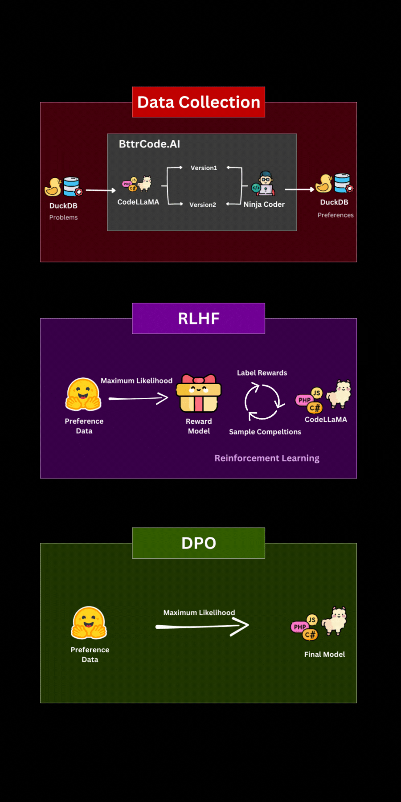
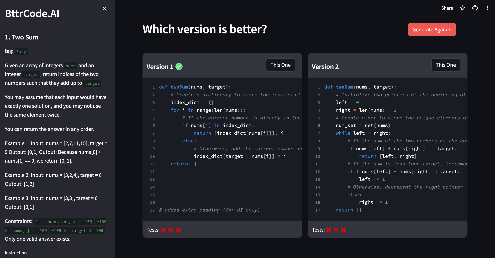
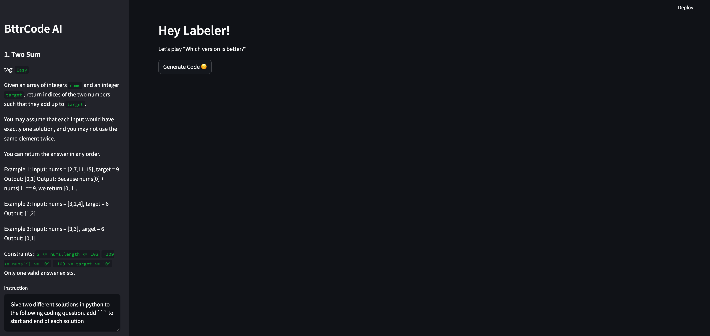

# Direct Preference Optimization (DPO)
An Improved Option Over Reinforcement Learning from Human Feedback (RLHF).

## Backgroud 
The standard procedure for the ```RLHF``` framework consists of three primary steps:

* Develop a supervised fine-tuning model (SFT model) from human-curated, high-quality datasets.
* Create a reward model based on comparison/preference data derived from human evaluations.
* Refine the policy using an RL method like proximal policy optimization (PPO).

In the paper [Direct Preference Optimization: Your Language Model is Secretly a Reward Model](https://arxiv.org/abs/2305.18290), the authors implement the Bradley and Terry model, a type of preference model, in the loss function. They showcase that there's no need for the second step as language models intrinsically serve as reward models. Remarkably, by eliminating this step, the issue becomes much more straightforward, narrowing down to an optimization task with a cross-entropy goal.

---

## Project Overview
This project is an end-to-end ML pipeline that covers data generation, huamn preference collection, and model training. 

It contains two major compoenents: a Streamlit app for huamn preference data collecction and a model training framework to train models with DPO.  


It uses codellama-7b as a base model and we want to train a model that can solve LeetCode questions in python. 

Here is a visual illustration for the data collection, and the difference between RLHF & DPO. 



---

## Data Collection 

All relevant files are located in the `preference_collection` folder. The app entry point is located in `code_generation_app.py`

A screenshot of the preference selection interface if code pair is present:


A screenshot of the code pair generation interface if code pair is not present: 


The UI interface fetches a list of LeetCode questions (question title, and detailed question description) from database and display one question a time on the sidebar. 

If the code pair is not generated, labelers can click on the Generate button to prompt ```codellama``` to generate two versions of python solutions. The generated codes will be displayed on the main windown. Labelers can go through the solution and select the preference to indicate which code version is better, in terms of correctness, performance and readability. 

Let's further break down the labeling interface into several major building blocks. 

### Ollama
```Ollama``` allows you to run LLMs locally. (check out the [website](https://ollama.ai/) and [github](https://github.com/jmorganca/ollama) to learn more). It currently supports Llama 2, Code Llama and many other models. 

After downloading Ollama, you can run the LLMs locally on your personal laptop. 

#### Pull a public model 
```
ollama pull codellama:7b
```

#### Run the model iteratively 
```
ollama run codellama:7b
```
 
Ollama also has an API for running and managing models. To start, run 
```
ollama serve 
```

The Streamlit app will call the API to prompt codellama to generate 2 versions of python solutions. 

```
curl -X POST http://localhost:11434/api/generate -d '{
  "model": "codellama",
  "prompt":YOUR PROMPT HERE
}'
```
### DuckDB
This project uses ```DuckDB``` as backend for storing and updating leetcode problemns, code pairs and human preferences. 

Why ```DuckDB```? ```DuckDB``` is an easy-to-install and use embedded database with no server configuration needed. It supports the full SQL standard, transactions, secondary indexes, and integrates with data analysis languages like Python and R. DuckDB is free, extensively tested for stability, and offers performance on par with specialized OLAP databases, making it suitable for a range of dataset sizes. (Learn more about [DuckDB](https://duckdb.org/) and [MotherDuck](https://motherduck.com/), which supports local, cloud or hybrid execution.)

Here is the Share URL for read-only access 
``` 
'md:_share/dpo/f64c68ea-ca25-425c-9ab0-03fbe00b6234'
```

Run this snippet to attach database
```
ATTACH 'md:_share/dpo/f64c68ea-ca25-425c-9ab0-03fbe00b6234'
```

### Streamlit App
Streamlit was launched to showcase projects via elegant web applications. It provides a streamlined interface for the Python environment, supporting APIs, models, and business strategies with simple coding.

This project uses Streamlit to build UI for interactively generating code pairs and collecting human preference. To start the streamlit app, run 
```
streamlit run code_generation_app.py
```

Note: in order for the code generation functionality to be working, Ollama shoud be up and running. 

### Hugging Face 
The collected human preference data is uploaded to [Hugging Face](https://huggingface.co/datasets/minfeng-ai/leetcode_preference). The dataset will be later used in the model training.  

---

## Model Training
All the files related to model training can be found in the `dpo_training` folder. 

The model training part is a reference implementation of the DPO algorithm for training language models from preference data, as described in the paper [Direct Preference Optimization: Your Language Model is Secretly a Reward Model](https://arxiv.org/abs/2305.18290).


The training related files are: 
- `train.py`: the main entry point for training (for both SFT and DPO)
- `trainers.py`: the trainer classes (e.g., implementing the loop of learning as well as multi-GPU logic)
- `utils.py`: some convenience functions used by multiple other files
- `preference_datasets.py`: dataset processing logic for both SFT and DPO preference-based training; **this is where you'll need to make some additions to train on your own data**

### Set up environment

First, create a virtualenv and install the dependencies. Python 3.8+ is recommended.

    python3 -m venv env
    source env/bin/activate
    pip install -r requirements.txt

### Supervised Fine-Tuning (SFT)
Run supervised fine-tuning (SFT) on the dataset(s) of interest.

For DPO, the SFT stage essentially ensures that the preference data we train on is in-distribution for our policy before we actually do the learning from preferences part.

Run SFT for codellama-7b with leetcode preference data with batch size 32:

    python -u train.py model=blank_model model.name_or_path=/PATH/TO/LLAMA/WEIGHTS model.block_name=LlamaDecoderLayer datasets=[lc] loss=sft exp_name=leetcode_sft_codellama_7b gradient_accumulation_steps=2 batch_size=64 eval_batch_size=32 trainer=FSDPTrainer sample_during_eval=false

### Running DPO

To run DPO, use the same command as SFT, but pass `loss=dpo`, `loss.beta=DESIRED_BETA` (0.1-0.5 is a good starting point), and `model.archive=/path/to/checkpoint/from/sft/step-XXXX/policy.pt`. If SFT completed successfully, you should also have a `/.../LATEST/policy.pt` from the end of training.

Run DPO on codellama-7b with batch size 32:

    python -u train.py model=codellama7b datasets=[lc] loss=dpo loss.beta=0.1 model.archive=/path/to/checkpoint/from/sft/step-XXXX/policy.pt exp_name=leetcode_dpo_codellama7b gradient_accumulation_steps=2 batch_size=32 eval_batch_size=32 trainer=FSDPTrainer sample_during_eval=false

> Note: `eval_every` is measured in **examples**.

### Trainer classes

There are three different trainer classes in `trainers.py`:
- `BasicTrainer`: For multiple GPUs, naively partition the model among them. e.g., for two GPUs, the first half of the model layers will be on GPU 0, the second half will be on GPU 1. This trainer effectively increases your available GPU memory without using multiple GPUs at once for compute (so you get no speedup).
- `FSDPTrainer`: Use PyTorch's [Fully Sharded Data Parallel](https://pytorch.org/docs/stable/fsdp.html) (FSDP) implementation to shard each transformer block amongst available GPUs. Should give a significant speedup over `BasicTrainer` with batch size per GPU >1. The batch size per gpu is equal to `batch_size / (gradient_accumulation_steps * num_gpus)`. **You may need to run `ulimit -n 64000` in your launch script before calling `train.py` with this trainer; e.g., `ulimit -n 64000; python train.py ...`.**
- `TensorParallelTrainer`: Use PyTorch tensor parallelism (with [this wrapper](https://github.com/BlackSamorez/tensor_parallel)) to shard each linear layer amongst available GPUs. This trainer is experimental, but should work.

**Warning:** Sampling may be very slow for `FSDPTrainer` and especially `TensorParallelTrainer` (see [this issue](https://github.com/pytorch/pytorch/issues/100069) and [this issue](https://github.com/BlackSamorez/tensor_parallel/issues/66), respectively for `FSDPTrainer` and `TensorParallelTrainer`). Passing `sample_during_eval=false` is recommended for these trainers.

#### Which trainer do I use?
 For single GPU training, use `BasicTrainer`. For many-GPU setups, `FSDPTrainer` will most likely be the best choice, though these haven't been benchmarked yet.

### Adding new datasets
Adding new/custom datasets is easy, and shouldn't take more than 10 minutes or so. Add your dataset to `preference_datasets.py` (we've implemented Anthropic-HH, Stanford Human Preferences, and StackExchange as references). Follow our reference datasets (in the functions `get_se()`, `get_shp()`, `get_hh()`); you essentially need to return a dict mapping each prompt to another dict containing three values:

- `responses: List[str]`: the list of responses on which preferences are given
- `pairs: List[Tuple[int]]`: the preference pairs, where the first value in each tuple is the preferred response and the second value is the dispreferred response
- `sft_target: str`: the response to use for this prompt during SFT (this response may or may not be one of the values in `responses`)

Once you've added your dataset, for example `xyz`, you can train on it by passing it to `datasets=[xyz]` to an SFT or DPO train command.

**Make sure you've updated `preference_datasets:get_dataset()` to return your new dataset when its name is passed in!**
 